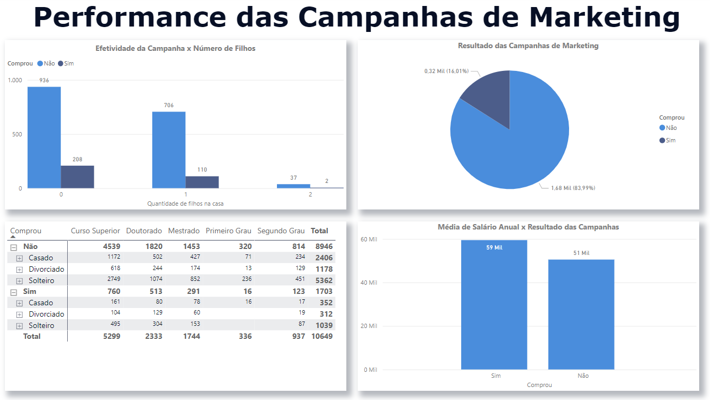

# Dashboard de Marketing
 

  

 

## Sobre o projeto
A partir dos dados que representam informações de clientes e campanhas de Marketing realizadas por uma empresa fícticia, foram criados 4  dashboards, com mais de  10  elementos  visuais customizados, separados de acordo com as seguintes informações:

* Cliente
* Comportamento de compra do cliente
* Performance das campanhas de marketing
* Padrões de compra no ponto de venda
  
O objetivo era o de fornecer uma visão completa sobre os clientes, seus perfis e padrões de compra, bem como a efetividade das campanhas do setor de marketing.

Foram implementados diversos recursos e conhecimentos ao dashboard como extração de métricas, trasnformação e cruzamento de dados, filtros e funções DAX.
 

* **[Projeto na íntegra (disponível para download)](https://github.com/raffaloffredo/dashboard_marketing/blob/main/Dashboard_Analises_Campanhas_de_Marketing.pbix)**
 

  

 

  

 

  

 

## Material Extra
Os dados utilizados nesse projeto também estão disponíveis para download.

* **[Dataset Marketing](https://github.com/raffaloffredo/dashboard_marketing/blob/main/dados_marketing.csv)**
 

## Outros projetos

* **[Dashboard de Vendas](https://github.com/raffaloffredo/dashboard_vendas)**
* **[Dashboard de Vendas Globais](https://github.com/raffaloffredo/dashboard_vendas_globais/)**
* **[Airbnb New York](https://github.com/raffaloffredo/airbnb_new_york_portuguese)**
* **[Estudo atualizado sobre COVID-19 no Brasil e no mundo](https://github.com/raffaloffredo/covid_2023_portuguese)**
* **[Detecção de fraude em cartão de crédito](https://github.com/raffaloffredo/fraud_detection_portuguese)**
 

 ## Contatos

  
  
  
  
  

